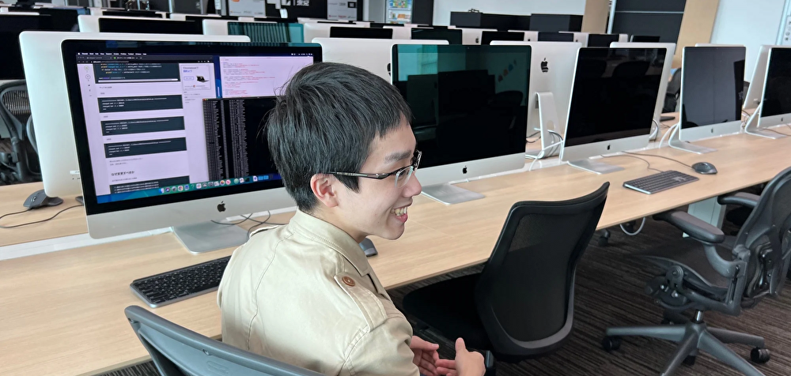

# Ayato Shitomi

 
  
  

## プロフィール

#### 2004年 札幌出身。 面白いことが大好き。様々な「やりたいこと」を追求します。

## 経歴

- 札幌光星中学校
- 札幌光星高校
- **LITE Inc.** バックエンドエンジニア・プログラマー

## 現在

- 札幌大通高校
- フランス発エンジニア養成機関 **42Tokyo** 本科生
- 個人事業 **LabPixel Frameworks** 代表（2022年4月設立）
- **株式会社イノベイト 寺子屋×ぷろぐれす** プログラミング教室講師
- **I.T.LAB** CTO（Chief Technology Officer）

## 各種サイト

#### <a href="https://ayato-shitomi.github.io/portfolio/" target="_blank">ポートフォリオ</a>　<a href="https://twitter.com/AyatoShitomi" target="_blank">Twitter</a>　<a href="https://www.wantedly.com/id/ayato_shitomi" target="_blank">Wantedly</a>　<a href="https://note.42tokyo.jp/n/naf350a626f45" target="_blank">42学生インタビュー</a>　<a href="https://www.instagram.com/ayato_shitomi/" target="_blank">Instagram</a>
